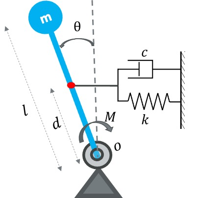
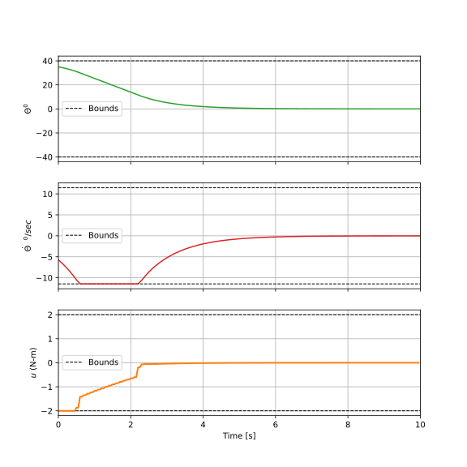

# NMPC Implementation: Toy Problem - Inverted Pendulum with Spring-Damper

This repository implements a **Nonlinear Model Predictive Control (NMPC)** for a **toy problem** consisting of an inverted pendulum coupled with a spring-damper arrangement.

## System Description

The system consists of a **massless rod** of length `l` with a mass `m` attached at the tip of the rod. The pendulum's angle, denoted as `θ`, is measured from the vertical. A spring-damper system is attached at a distance `d` along the pendulum, creating a restriction on the pendulum’s motion, i.e., $-40^\circ \leq \theta \leq 40^\circ$. The control input is the moment or torque $M$ applied at the base of the pendulum.

### Parameters:
- **Mass** ($m$) = 0.15 kg
- **Length** ($l$) = 4 m
- **Spring Constant** ($k$) = 0.3 N/m
- **Damping Coefficient** ($c$) = 0.05 Ns/m
- **Gravity** ($g$) = 9.81 m/s²
- **Distance for spring-damper attachment** ($d$) = 3.5 m

### Objective:
The goal is to balance the pendulum around the vertical position ($\theta = 0^\circ$) using control input $M$ (torque). 

## Model

The system is modeled using the **equation of motion (EOM)**, derived from the balance of moments at the base of the pendulum, leading to the following state-space form:

$$
\dot{x_1} = x_2
$$

$$
\dot{x_2} = -\frac{k d^2}{m l^2} \sin(x_1) \cos(x_1) - \frac{c d^2}{m l^2} \cos^2(x_1) \dot{x_1} + \frac{g}{l} \sin(x_1) + \frac{u}{m l^2}
$$

Where:
- $x_1 = \theta$ (angle)
- $x_2 = \dot{\theta}$ (angular velocity)
- $u = M$ (control torque)

The system is inherently unstable around the equilibrium point $(x_1, x_2) = (0, 0)$ and requires stabilization through feedback control.

## Control Strategy: NMPC

A **Model Predictive Control (MPC)** approach is used to stabilize the pendulum around the upright position. The problem is formulated as an **optimal control problem (OCP)**, where the objective is to minimize the cost function:

$$
\text{min  } J = \int_0^{t_N} \left\|\mathbf{x} - \mathbf{x}_{\text{ref}}\right\|_\mathbf{Q}^2 + \left\|\mathbf{u} - \mathbf{u}_{\text{ref}}\right\|_\mathbf{R}^2 +J_T,
$$
with 
$$
J_T= \left\|\mathbf{x}(t_N) - \mathbf{x}_{\text{ref}}(t_N)\right\|^2_\mathbf{Q_T},
$$

Where:
- $Q = 1000 \times I_2$ (penalizes deviations from the desired state)
- $R = 0.1$ (penalizes control effort)

## Constraints:
- $-40^\circ \leq \theta \leq 40^\circ$
- $-11.4592 \leq \dot{\theta} \leq 11.4592$ (angular velocity)
- $-2 \leq M \leq 2$ (control input)

## Results

The results of the simulation are shown below. The **MPC Horizon** is set to 0.5 seconds, with 5 divisions in the horizon. The computation time for each MPC step is on average 0.06 ms.

## How to Run
1. Clone this repository to your local machine.
2. Install the required dependencies (e.g., `acados`, `numpy`, `matplotlib`).
3. Run `mpc_script.py` to observe the behavior of the pendulum under NMPC.

## License

This code is licensed under the MIT License.
